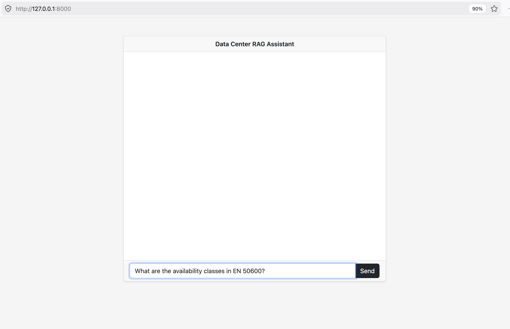
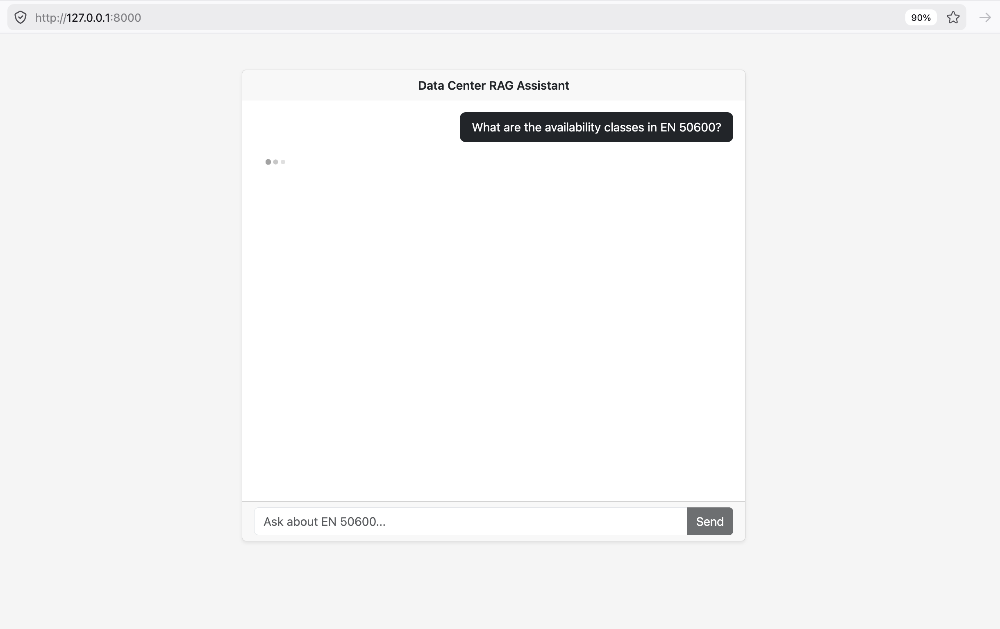
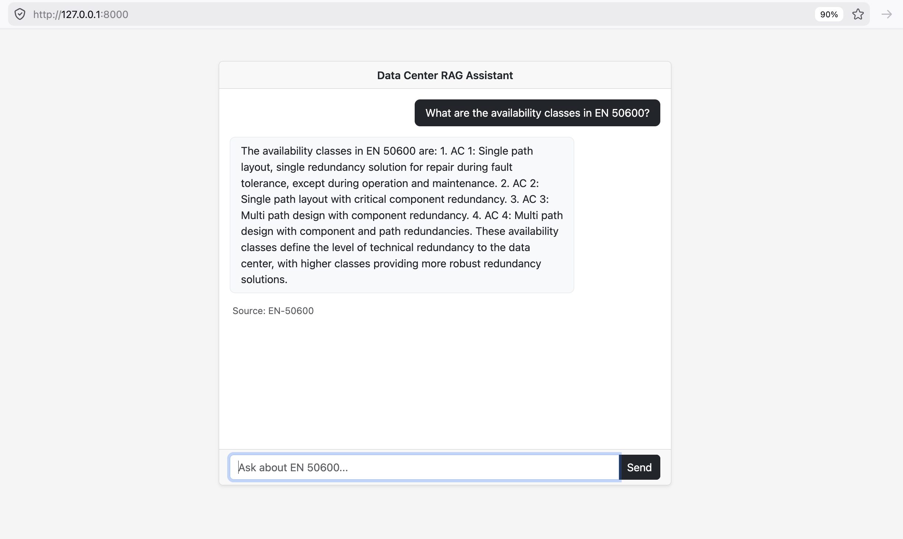

# Data Center RAG Assistant

A Retrieval-Augmented Generation (RAG) assistant that answers questions about data center planning standards by searching through ingested documents. Built to demonstrate how organizations can leverage AI for internal knowledge retrieval **without exposing sensitive operational data to external APIs**.

## Why This Matters for Data Centers

Data center operators work with highly sensitive information — infrastructure blueprints, redundancy configurations, client SLAs, cooling system specifications, and compliance documentation. Sending this data to cloud-hosted AI services introduces real risks: data sovereignty violations, exposure of physical security details, and potential non-compliance with regulations like GDPR or industry-specific standards.

This project runs **entirely on local infrastructure**. The embedding model and the LLM both run via Ollama on the same machine that hosts the data. No document content ever leaves the network. For an industry built on trust and uptime, this isn't a nice-to-have — it's a requirement.

## How It Works

The system has two pipelines:

**Ingestion (runs once per document)**

PDF → extract text (pdfplumber) → split into overlapping chunks → embed each chunk (Ollama nomic-embed-text) → store in Postgres with pgvector

**Query (runs on every question)**

User question → embed with same model → pgvector cosine similarity search → top 5 chunks → LLM generates answer grounded in context → response with source citation

The key insight: both pipelines use the **same embedding model**, so the question's vector lands in the same 768-dimensional space as the document chunks. Similar meaning = nearby vectors = relevant results.

## Screenshots

| Ask a question | Thinking | Answer with source |
|:-:|:-:|:-:|
|  |  |  |

## Tech Stack

| Component | Technology | Why |
|---|---|---|
| Backend | Django | Familiar, batteries-included, ORM handles pgvector natively |
| Database | PostgreSQL + pgvector | Vector similarity search without a separate vector DB |
| Embeddings | Ollama + nomic-embed-text (768 dims) | Runs locally, no API keys, no data leaves the machine |
| LLM | Ollama + llama3.2 | Local inference, suitable for on-prem deployment |
| PDF Parsing | pdfplumber | Reliable text extraction with table support |
| Frontend | Vanilla HTML/CSS/JS | Minimal chat interface with AJAX, no framework overhead |

## Project Structure

```
RAG-Assistant/
├── manage.py
├── core/                     # Django project settings
├── rag/                      # Main app
│   ├── models.py             # Document + Chunk (with VectorField)
│   ├── views.py              # Query endpoint (embed → search → LLM → respond)
│   ├── management/
│   │   └── commands/
│   │       └── ingest.py     # PDF ingestion pipeline
│   └── admin.py
├── templates/
│   └── search_results.html   # Chat interface
├── files/                    # Source PDFs
└── screenshots/
```

## Setup

**Prerequisites:** Python 3.10+, Docker, Ollama

1. Clone and install dependencies:
```bash
git clone https://github.com/drizzlle/RAG-Assistant.git
cd RAG-Assistant
python -m venv .venv
source .venv/bin/activate
pip install django psycopg2-binary pgvector pdfplumber requests
```

2. Start Postgres with pgvector:
```bash
docker run -d --name pgvector \
  -e POSTGRES_DB=rag_db \
  -e POSTGRES_USER=postgres \
  -e POSTGRES_PASSWORD=postgres \
  -p 5432:5432 \
  pgvector/pgvector:pg16
```

3. Pull the Ollama models:
```bash
ollama pull nomic-embed-text
ollama pull llama3.2
```

4. Run migrations and ingest:
```bash
python manage.py migrate
python manage.py ingest
```

5. Start the server:
```bash
python manage.py runserver
```

Visit `http://localhost:8000/` and ask a question.

## Design Decisions

**pgvector over a dedicated vector DB** — Postgres is already in the stack. Adding Pinecone or Weaviate means another service to operate, another network hop, and another place data lives. pgvector keeps everything in one database.

**Local models over cloud APIs** — For a company hosting client infrastructure, sending internal documents to OpenAI or Anthropic may be a non-starter. Ollama runs on-prem with zero external calls. Smaller local models also reduce energy consumption compared to repeatedly hitting large cloud models.

**Simple character-based chunking** — A fixed 1000-character window with 150-character overlap. No semantic chunking, no sentence boundary detection. For a standards document with structured prose, this works well and is trivially explainable.

**No fallback mechanisms** — If embedding fails or the LLM is down, the error surfaces directly. Silent fallbacks hide real failures and erode trust in enterprise tools.

**Idempotent ingestion** — A SHA-256 hash of the file content prevents duplicate ingestion. Re-running `python manage.py ingest` on the same PDF is a safe no-op.

## What I'd Improve in a Production Scenario

- **Incremental ingestion** — watch a folder or integrate with document management systems for automatic ingestion of new documents
- **Role-based access** — restrict which documents different staff roles can query, critical when SOPs contain sensitive operational details
- **Feedback loops** — let users flag bad answers to identify weak chunks or prompt issues
- **Streaming responses** — stream the LLM output token-by-token for better UX on longer answers
- **Hybrid search** — combine vector similarity with keyword search (BM25) for higher retrieval accuracy
- **Chunk metadata** — store page numbers and section headings so citations point to exact locations in the source PDF
- **Multiple document support** — UI for uploading and managing multiple PDFs with per-document filtering
- **Authentication** — user login and audit logging for compliance

## License

MIT